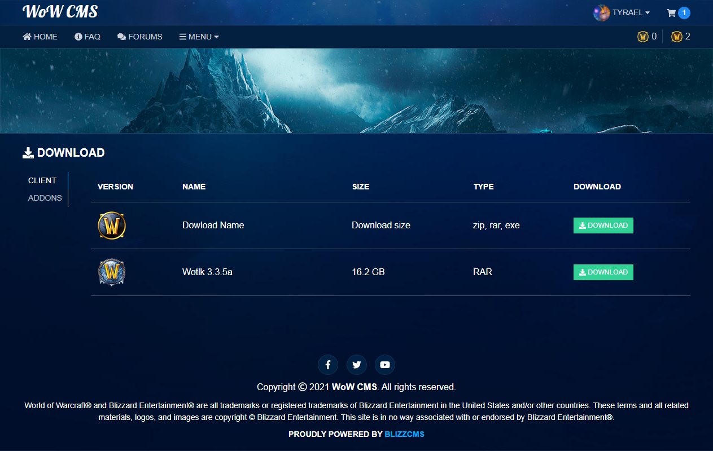

# Download Module

Download Module for BlizzCMS-Plus

# Requirements

**_BlizzCMS Plus_** -> 1.0.4

# Installation

You must place the files in the corresponding folders.
The "download" folder must go inside the Modules folder.
Open the file: `application/config/route.php` and add these lines

```
/* DOWNLOAD */
$route[$lang.'/download'] = 'download/index';

```

--- SQL ---

Run the SQL files that we have left in the folder and add your downloads.
We have left an example of how it would look.

Now go to your website and click on the link/download.
It should look something like this: `https://wow-cms/en/download`

Enjoy.

## Copyright

Copyright © 2021 [WoW-CMS](https://wow-cms.com).
Developed by Tyrael

# Screenshots

